<h1 align="center">Anjali Chaudhary</h1>

<p align="center">
  <b>Principal Software Engineer at Great Learning</b><br/>
  AI-powered learning systems and scalable assessment platforms &nbsp;·&nbsp; 8+ years, from a Rails internship to principal
</p>

<p align="center">
  <a href="https://www.linkedin.com/in/anjali-chaudhary"></a>
  <a href="https://github.com/anjalichaudhary/anjalichaudhary/actions/workflows/readme.yml"></a>
</p>

<!-- Uncomment once anjalichaudhary.com stops redirecting to itself.
<p align="center">
  <a href="https://anjalichaudhary.com"></a>
</p>
-->

<p align="center">
  <a href="https://anjalichaudhary.github.io/anjalichaudhary/"></a>
</p>

<p align="center"><b><a href="https://anjalichaudhary.github.io/anjalichaudhary/">▶ Open the player</a></b> to pause, scrub and jump between scenes.</p>

### ❚❚ Scene selection

Or stay here: every scene, paused. Open any chapter and read at your own pace.

<!-- scenes:start -->
<details>
<summary><b>2026–now</b> · the agentic mentor · principal software engineer @ Great Learning</summary>
<br/>
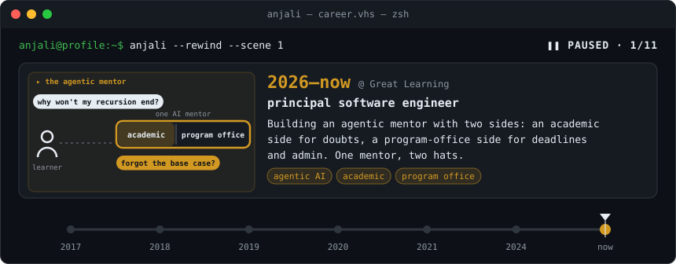
</details>
<details>
<summary><b>2024–now</b> · the AI teacher · lead → principal software engineer @ Great Learning</summary>
<br/>
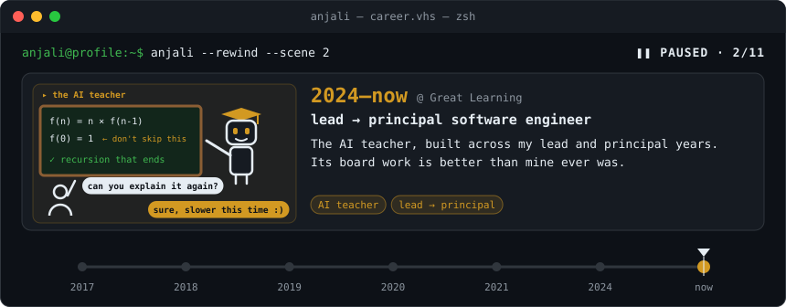
</details>
<details>
<summary><b>2024–26</b> · the course-aware mentor · lead software engineer @ Great Learning</summary>
<br/>
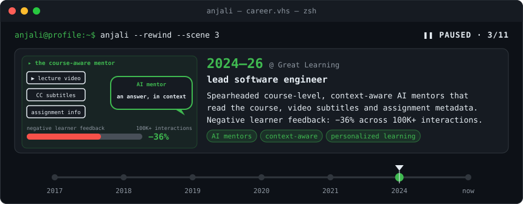
</details>
<details>
<summary><b>2024–26</b> · the prompt exam hall · lead software engineer @ Great Learning</summary>
<br/>
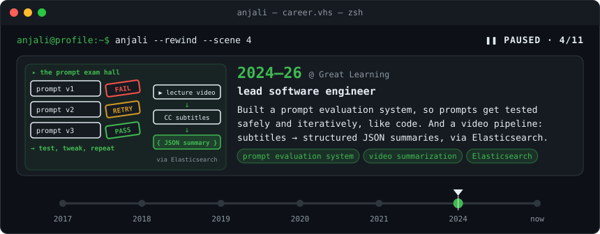
</details>
<details>
<summary><b>2021–24</b> · coding labs in the cloud · senior software development engineer @ Great Learning</summary>
<br/>
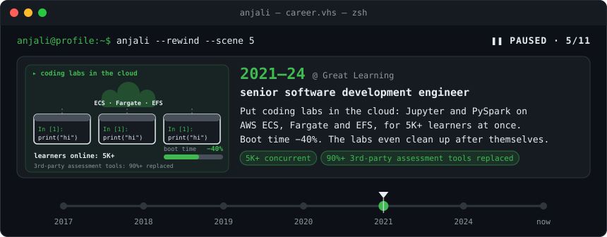
</details>
<details>
<summary><b>2021–24</b> · the MCQ-o-matic · senior software development engineer @ Great Learning</summary>
<br/>
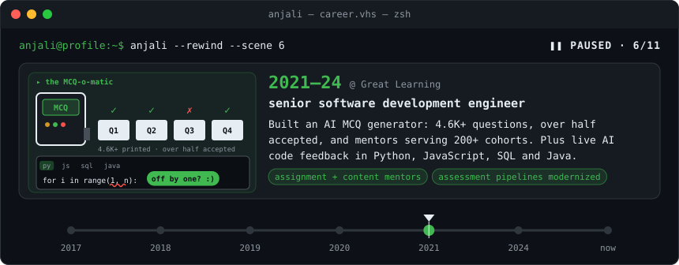
</details>
<details>
<summary><b>2020–21</b> · the LMS speed run · software development engineer @ Great Learning</summary>
<br/>
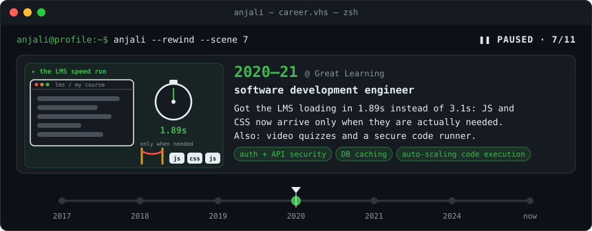
</details>
<details>
<summary><b>2019–20</b> · the great migration · software development engineer @ Applied AI Course</summary>
<br/>
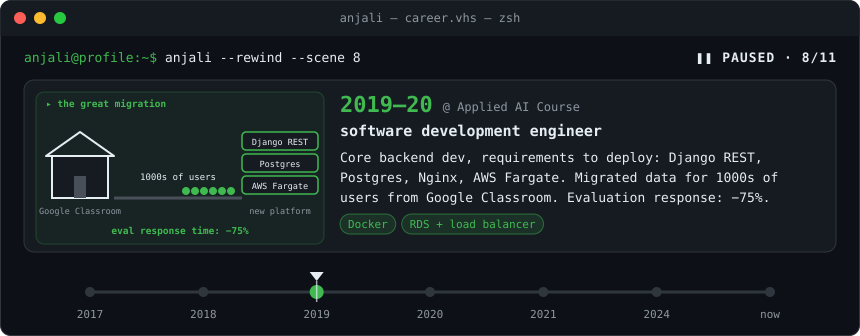
</details>
<details>
<summary><b>2018–19</b> · vehicles, tolls &#38; texts · software development engineer @ Goomo</summary>
<br/>
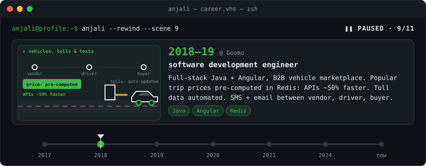
</details>
<details>
<summary><b>2017</b> · bug hunt, level 1 · software engineer intern @ Goomo</summary>
<br/>
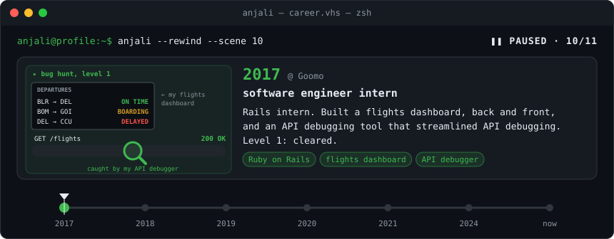
</details>
<details>
<summary><b>now</b> · thanks for watching · rewind complete</summary>
<br/>
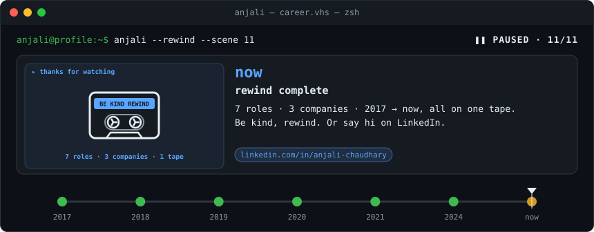
</details>
<!-- scenes:end -->

<details>
<summary>Read the tape as text</summary>

```text
$ anjali --rewind
◀◀ 2026–now · the agentic mentor · principal software engineer @ Great Learning
   Building an agentic mentor with two sides: an academic
   side for doubts, a program-office side for deadlines
   and admin. One mentor, two hats.
   [agentic AI] [academic] [program office]
◀◀ 2024–now · the AI teacher · lead → principal software engineer @ Great Learning
   The AI teacher, built across my lead and principal years.
   Its board work is better than mine ever was.
   [AI teacher] [lead → principal]
◀◀ 2024–26 · the course-aware mentor · lead software engineer @ Great Learning
   Spearheaded course-level, context-aware AI mentors that
   read the course, video subtitles and assignment metadata.
   Negative learner feedback: −36% across 100K+ interactions.
   [AI mentors] [context-aware] [personalized learning]
◀◀ 2024–26 · the prompt exam hall · lead software engineer @ Great Learning
   Built a prompt evaluation system, so prompts get tested
   safely and iteratively, like code. And a video pipeline:
   subtitles → structured JSON summaries, via Elasticsearch.
   [prompt evaluation system] [video summarization] [Elasticsearch]
◀◀ 2021–24 · coding labs in the cloud · senior software development engineer @ Great Learning
   Put coding labs in the cloud: Jupyter and PySpark on
   AWS ECS, Fargate and EFS, for 5K+ learners at once.
   Boot time −40%. The labs even clean up after themselves.
   [5K+ concurrent] [90%+ 3rd-party assessment tools replaced]
◀◀ 2021–24 · the MCQ-o-matic · senior software development engineer @ Great Learning
   Built an AI MCQ generator: 4.6K+ questions, over half
   accepted, and mentors serving 200+ cohorts. Plus live AI
   code feedback in Python, JavaScript, SQL and Java.
   [assignment + content mentors] [assessment pipelines modernized]
◀◀ 2020–21 · the LMS speed run · software development engineer @ Great Learning
   Got the LMS loading in 1.89s instead of 3.1s: JS and
   CSS now arrive only when they are actually needed.
   Also: video quizzes and a secure code runner.
   [auth + API security] [DB caching] [auto-scaling code execution]
◀◀ 2019–20 · the great migration · software development engineer @ Applied AI Course
   Core backend dev, requirements to deploy: Django REST,
   Postgres, Nginx, AWS Fargate. Migrated data for 1000s of
   users from Google Classroom. Evaluation response: −75%.
   [Docker] [RDS + load balancer]
◀◀ 2018–19 · vehicles, tolls & texts · software development engineer @ Goomo
   Full-stack Java + Angular, B2B vehicle marketplace. Popular
   trip prices pre-computed in Redis: APIs ~50% faster. Toll
   data automated. SMS + email between vendor, driver, buyer.
   [Java] [Angular] [Redis]
◀◀ 2017 · bug hunt, level 1 · software engineer intern @ Goomo
   Rails intern. Built a flights dashboard, back and front,
   and an API debugging tool that streamlined API debugging.
   Level 1: cleared.
   [Ruby on Rails] [flights dashboard] [API debugger]
▶▶ fast-forwarding back to now…
▶  now · thanks for watching · rewind complete
   7 roles · 3 companies · 2017 → now, all on one tape.
   Be kind, rewind. Or say hi on LinkedIn.
   [linkedin.com/in/anjali-chaudhary]
```

</details>

## How I work

- **Test prompts like code.** Evaluate, tweak, re-run. An AI's behaviour is a rate over many runs, not one good demo.
- **Measure, then speed up.** Page loads from 3.1s to 1.89s; lab boot time down 40%.
- **Automate the boring parts.** From an API debugging tool as an intern to cloud labs that clean up after themselves.
- **Secure by default.** Least privilege for people, services and AI agents alike.
- **Keep it simple.** Systems the next engineer can own and debug.
- **Show the source.** The numbers on this page are from my LinkedIn; ask me for the story behind any of them.

## Stack

| | |
|---|---|
| **AI** |      |
| **Backend** |          |
| **Data** |       |
| **Frontend** |      |
| **Infra** |       |

---

<p align="center"><sub>This page tests itself: on every change and on a daily schedule, a read-only workflow checks the links and badges it can reach (LinkedIn blocks bots) and verifies the animation matches <a href="scripts/render-story.mjs">its source</a>. No third-party scripts, no tokens with write access.</sub></p>
