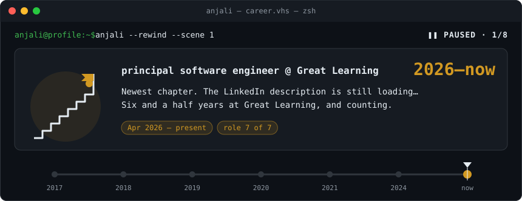
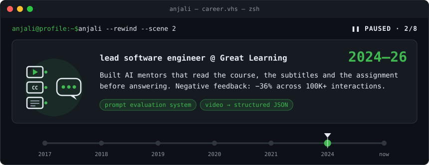
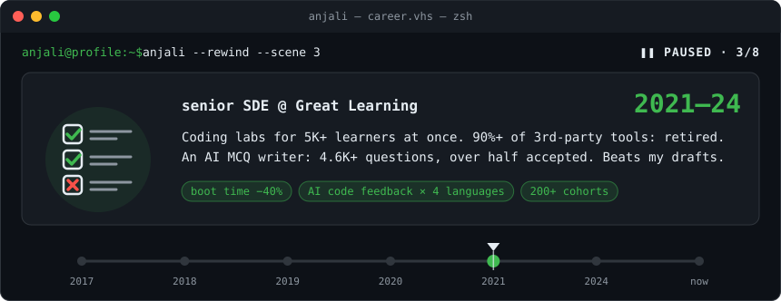
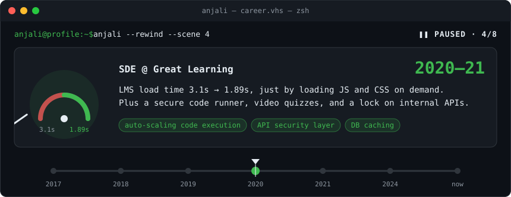
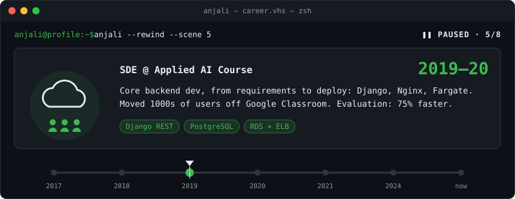
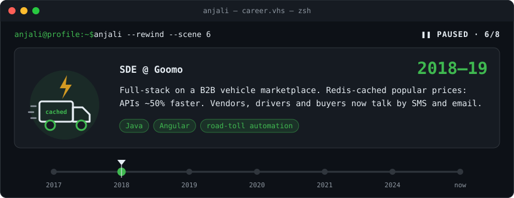
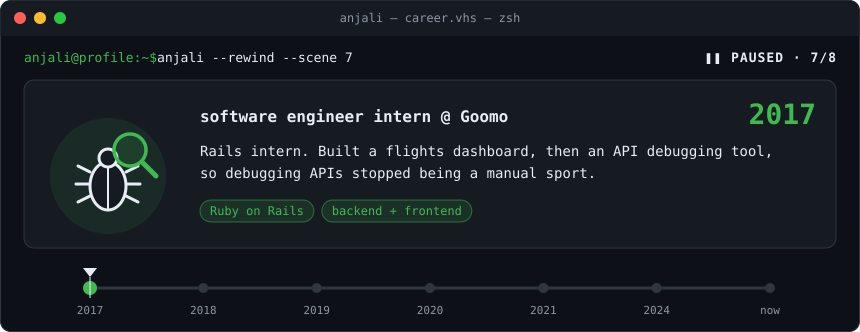
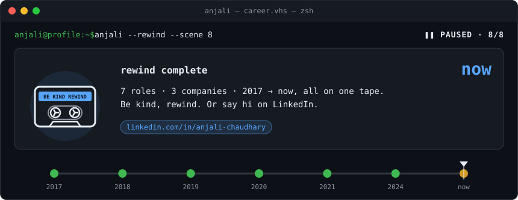

<h1 align="center">Anjali Chaudhary</h1>

<p align="center">
  <b>Principal Software Engineer at Great Learning</b><br/>
  AI-powered learning systems and scalable assessment platforms &nbsp;·&nbsp; 8+ years, from a Rails internship to principal
</p>

<p align="center">
  <a href="https://www.linkedin.com/in/anjali-chaudhary"></a>
  <a href="https://github.com/anjalichaudhary/anjalichaudhary/actions/workflows/readme.yml"></a>
</p>

<!-- Uncomment once anjalichaudhary.com stops redirecting to itself.
<p align="center">
  <a href="https://anjalichaudhary.com"></a>
</p>
-->

<p align="center">
  
</p>

### ❚❚ Scene selection

GitHub can't pause an image, so here is every scene, paused. Open any chapter and read at your own pace.

<!-- scenes:start -->
<details>
<summary><b>2026–now</b> · principal software engineer @ Great Learning</summary>
<br/>

</details>
<details>
<summary><b>2024–26</b> · lead software engineer @ Great Learning</summary>
<br/>

</details>
<details>
<summary><b>2021–24</b> · senior SDE @ Great Learning</summary>
<br/>

</details>
<details>
<summary><b>2020–21</b> · SDE @ Great Learning</summary>
<br/>

</details>
<details>
<summary><b>2019–20</b> · SDE @ Applied AI Course</summary>
<br/>

</details>
<details>
<summary><b>2018–19</b> · SDE @ Goomo</summary>
<br/>

</details>
<details>
<summary><b>2017</b> · software engineer intern @ Goomo</summary>
<br/>

</details>
<details>
<summary><b>now</b> · rewind complete</summary>
<br/>

</details>
<!-- scenes:end -->

<details>
<summary>Read the tape as text</summary>

```text
$ anjali --rewind
◀◀ 2026–now · principal software engineer @ Great Learning
   Newest chapter. The LinkedIn description is still loading…
   Six and a half years at Great Learning, and counting.
   [Apr 2026 – present] [role 7 of 7]
◀◀ 2024–26 · lead software engineer @ Great Learning
   Built AI mentors that read the course, the subtitles and the assignment
   before answering. Negative feedback: −36% across 100K+ interactions.
   [prompt evaluation system] [video → structured JSON]
◀◀ 2021–24 · senior SDE @ Great Learning
   Coding labs for 5K+ learners at once. 90%+ of 3rd-party tools: retired.
   An AI MCQ writer: 4.6K+ questions, over half accepted. Beats my drafts.
   [boot time −40%] [AI code feedback × 4 languages] [200+ cohorts]
◀◀ 2020–21 · SDE @ Great Learning
   LMS load time 3.1s → 1.89s, just by loading JS and CSS on demand.
   Plus a secure code runner, video quizzes, and a lock on internal APIs.
   [auto-scaling code execution] [API security layer] [DB caching]
◀◀ 2019–20 · SDE @ Applied AI Course
   Core backend dev, from requirements to deploy: Django, Nginx, Fargate.
   Moved 1000s of users off Google Classroom. Evaluation: 75% faster.
   [Django REST] [PostgreSQL] [RDS + ELB]
◀◀ 2018–19 · SDE @ Goomo
   Full-stack on a B2B vehicle marketplace. Redis-cached popular prices:
   APIs ~50% faster. Vendors, drivers and buyers now talk by SMS and email.
   [Java] [Angular] [road-toll automation]
◀◀ 2017 · software engineer intern @ Goomo
   Rails intern. Built a flights dashboard, then an API debugging tool,
   so debugging APIs stopped being a manual sport.
   [Ruby on Rails] [backend + frontend]
▶▶ fast-forwarding back to now…
▶  now · rewind complete
   7 roles · 3 companies · 2017 → now, all on one tape.
   Be kind, rewind. Or say hi on LinkedIn.
   [linkedin.com/in/anjali-chaudhary]
```

</details>

## How I work

- **Evals, not vibes.** An AI behaviour is a rate over many runs, not one good demo.
- **Least privilege for AI.** An agent gets only the tools and arguments it actually needs.
- **Reproduce before fix.** Show it broken without the change and fixed with it.
- **Boring architecture.** Simple systems the next engineer can own and debug.
- **Claims need evidence.** Every number I report traces back to a query, a log, or a line of code.

## Stack

| | |
|---|---|
| **AI** |      |
| **Backend** |          |
| **Data** |       |
| **Frontend** |      |
| **Infra** |       |

---

<p align="center"><sub>This page tests itself: a read-only workflow checks every link and badge daily and verifies the animation matches <a href="scripts/render-story.mjs">its source</a>. No third-party scripts, no tokens with write access.</sub></p>
